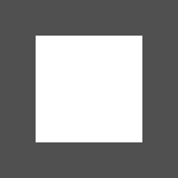
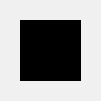
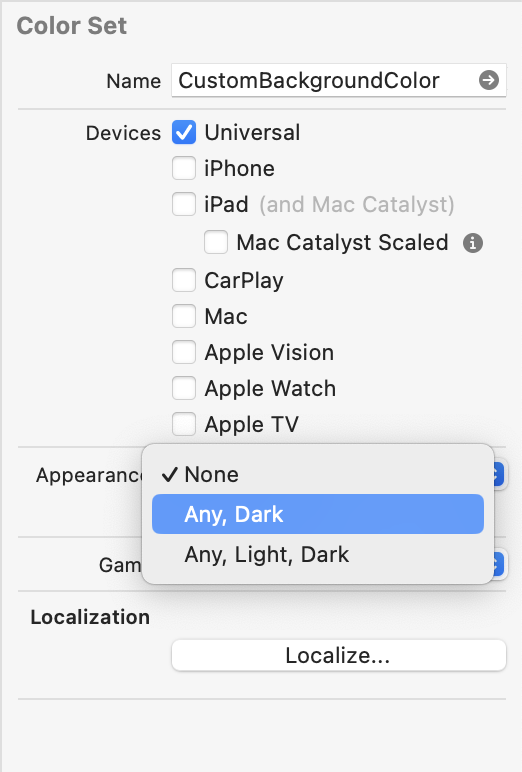
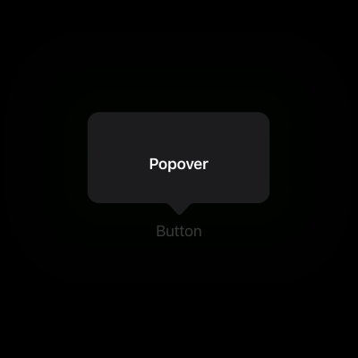
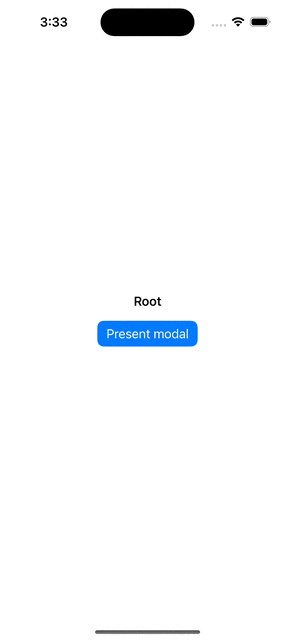
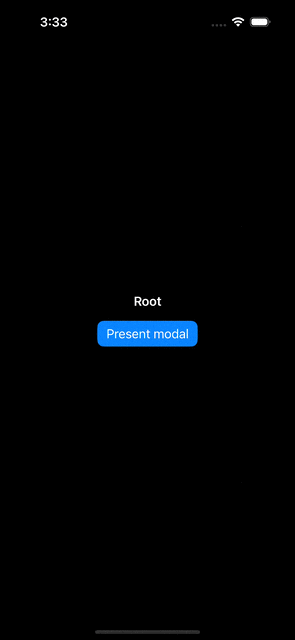
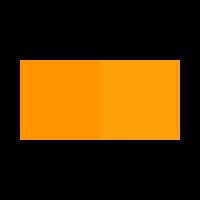
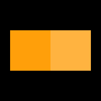
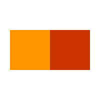

# Making truly adaptive color systems in iOS
*This article will be be helpful mostly to designers and developers who design their own apps. It covers the basics of working with colors in iOS; however, the same principles can be applied to other Apple's platforms.*

## The basics
With the release of iOS 13, users finally received dark mode support, and developers got their hands on the new APIs to make their apps truly shine in both appearances. Unfortunately, there are still a lot of apps that don't support dark mode, and those who do, often miss key aspects of adaptivity in their color systems.  

First, let's take a look at the new `UIColor` API, which provides a brand-new set of colors that are specifically designed to adapt to the current user interface appearance. Take `.systemBackground` as an example. Here's how it looks in both light and dark appearances:  

| `.systemBackground` (light appearance) | `.systemBackground` (dark appearance) |
|:--------------------------------------:|:-------------------------------------:|
|               |               |

Besides this particular color, the new API provides a large set of colors that cover most of the use cases when designing an app. These colors are typically ordered by their priority, for example, `.systemBackground`, `.secondarySystemBackground`, and `.tertiarySystemBackground`. Here's a full list of adaptive colors, available starting with iOS 13:  

**System Fill**  
Used for items situated on top of existing background color
- `.systemFill`
- `.secondarySystemFill`
- `.tertiarySystemFill`
- `.quaternarySystemFill`

**System Background**  
Used as a regular background
- `.systemBackground`
- `.secondarySystemBackground`
- `.tertiarySystemBackground`

**System Grouped Background**  
Used as a background of grouped collections
- `.systemGroupedBackground`
- `.secondarySystemGroupedBackground`
- `.tertiarySystemGroupedBackground`

**Label**  
Used for text labels
- `.label`
- `.secondaryLabel`
- `.tertiaryLabel`
- `.quaternaryLabel`
- `.placeholderText`

**Separator**  
Used to create separation between content
- `.separator`
- `.opaqueSeparator`

**System Gray**
- `.systemGray`
- `.systemGray2`
- `.systemGray3`
- `.systemGray4`
- `.systemGray5`
- `.systemGray6`

**System Colors**
- `.systemBlue`
- `.systemBrown`
- `.systemCyan`
- `.systemGreen`
- `.systemIndigo`
- `.systemMint`
- `.systemOrange`
- `.systemPink`
- `.systemPurple`
- `.systemRed`
- `.systemTeal`
- `.systemYellow`

You can read more and see color swatches on [Apple Developer portal](https://developer.apple.com/design/human-interface-guidelines/color).

## How does it work?
Earlier in this article, we went over the available system colors that can be used for building adaptive apps, but what if we wanted to make our own adaptive color system?  
Specifically for this purpose, iOS 13 introduced a new `UIColor` initializer that can dynamically resolve colors based on the given trait collection (`UITraitCollection`).  

> `UITraitCollection` is a collection of data that represents the environment for an individual element in your app’s user interface. [Apple Developer Documentation](https://developer.apple.com/documentation/uikit/uitraitcollection)  

```swift
@available(iOS 13.0, *)
public init(dynamicProvider: @escaping (UITraitCollection) -> UIColor)
```
Using this initializer, we can create a custom color that will be dynamically resolved based on the current user interface appearance:  

```swift
let customBackgroundColor = UIColor { traitCollection in
    switch traitCollection.userInterfaceStyle {
        case .light, .unspecified:
            // Return a color suitable for light appearance
            return UIColor(hex: "#FFFFFF")
        case .dark:
            // Return a color suitable for dark appearance
            return UIColor(hex: "#000000")
    }
}
```

You can also create custom colors in the Asset Catalog by selecting the "Any, Dark" option in the "Appearances" selector in the right inspector.  



## The problem and its solution
Unfortunately, it is still widely believed that making a color variation for the dark appearance is just inverting the one that is used for the light appearance. As we move further away from the flat design concept introduced with iOS 7, our user interfaces slowly gain more 3D-ish elements and presentation styles, that require more than one variation of color. To better cover this topic, I will now tell you about two more lesser-known properties of `UITraitCollection` that can be used to produce colors that are most suitable for the current environment.  

#### Elevation level
With the release of iOS 13, we got a new Page Sheet modal presentation style, which you might've noticed in the system apps like Messages, Mail, Clock, and some others. You might've also noticed that in the dark appearance, the `.systemBackground` color of modal sheet slightly changes from pure black to a dark gray color. This is done deliberately to create contrast between the sheet and the background layer:  

  

The same goes for Popover modal presentation style:  

  

Now let's try making a custom background color for our own color system. We can do so by using the aforementioned color initializer, just like this:  

```swift
extension UIColor {
    static let customBackgroundColor = UIColor { traitCollection in
        switch traitCollection.userInterfaceStyle {
            case .unspecified, .light:
                return UIColor(red: 255/255, green: 255/255, blue: 255/255, alpha: 1)
            case .dark:
                return UIColor(red: 0/255, green: 0/255, blue: 0/255, alpha: 1)
        }
    }
}
```

|            Light appearance            |            Dark appearance            |
|:--------------------------------------:|:-------------------------------------:|
|  |  |

Using the light appearance, there's no difference between our custom color and `.systemBackground`; in the dark appearance, however, we can barely see the sheet as it has the same color as the background layer.  
It happened because system background colors not only adapt to appearance, but also adapt to something called user interface elevation level. This parameter is also a part of `UITraitCollection` and is named `.userInterfaceLevel`. This parameter has two primary values: `.base` and `.elevated`. Let's add some code to account for it:  

```diff
extension UIColor {
    static let customBackgroundColor = UIColor { traitCollection in
        switch traitCollection.userInterfaceStyle {
            case .unspecified, .light:
                return UIColor(red: 255/255, green: 255/255, blue: 255/255, alpha: 1)
+           case .dark where traitCollection.userInterfaceLevel == .elevated:
+               return UIColor(red: 28/255, green: 28/255, blue: 30/255, alpha: 1)
            case .dark:
                return UIColor(red: 0/255, green: 0/255, blue: 0/255, alpha: 1)
        }
    }
}
```

By adding this case, we can achieve results similar to `.systemBackground` color, shown in the GIF earlier in this article. Now, when we present a modal sheet, its background color will be automatically adjusted to the elevation level of the user interface.

#### System Colors and Accessibility
In the beginning of this article, I went over system colors like blue, red, green, and others, and called them adaptive. And I meant it. For example, when we make a side-by-side comparison of `.systemOrange` color resolved for both appearances, if you look closely, you can see a slight difference:  



In the dark appearance (the right color swatch), the color lost some of its vibrancy to allow for better contrast. Other ordinary system colors do that too.  
But that's not all there's to it about adaptive system colors. There is also another trait collection parameter that may often affect the resolved color, and it is the `.accessibilityContrast`. This parameter hints to the developer whether the Increased Contrast option is enabled in accessibility settings. Let's see how system colors behave with this setting enabled by taking a look at `.systemOrange` color. The color swatch on the left uses the regular color, while the swatch on the right uses the high-contrast one.  

  

  

The resulting color differs quite a lot with this setting enabled. It is specifically designed to provide better contrast between the element and its background. Here's how we can utilize this parameter to add a high-contrast variation to our color for this exact case:  
```swift
extension UIColor {
    static let customAccentColor = UIColor { traitCollection in
        let isHighContrastEnabled = traitCollection.accessibilityContrast == .high

        switch traitCollection.userInterfaceStyle {
            case .unspecified, .light:
                return isHighContrastEnabled
                    // A color with higher contrast suitable for light appearance
                    ? UIColor(...)
                    // A color with regular constrast suitable for light appearance
                    : UIColor(...)
            case .dark:
                return isHighContrastEnabled
                    // A color with higher contrast suitable for dark appearance
                    ? UIColor(...)
                    // A color with regular constrast suitable for dark appearance
                    : UIColor(...)
        }
    }
}
```

## Conclusion
Adaptive colors are not just black and white background colors or a single accent color; they are colors that use environment context to create user interface elements that pop out and are easy to read. If you are developing an app for iOS, please make sure to use system adaptive colors whenever possible. And if you're designing your own custom design system, please make sure its colors use the context clues mentioned in this article to create an inclusive color palette.
